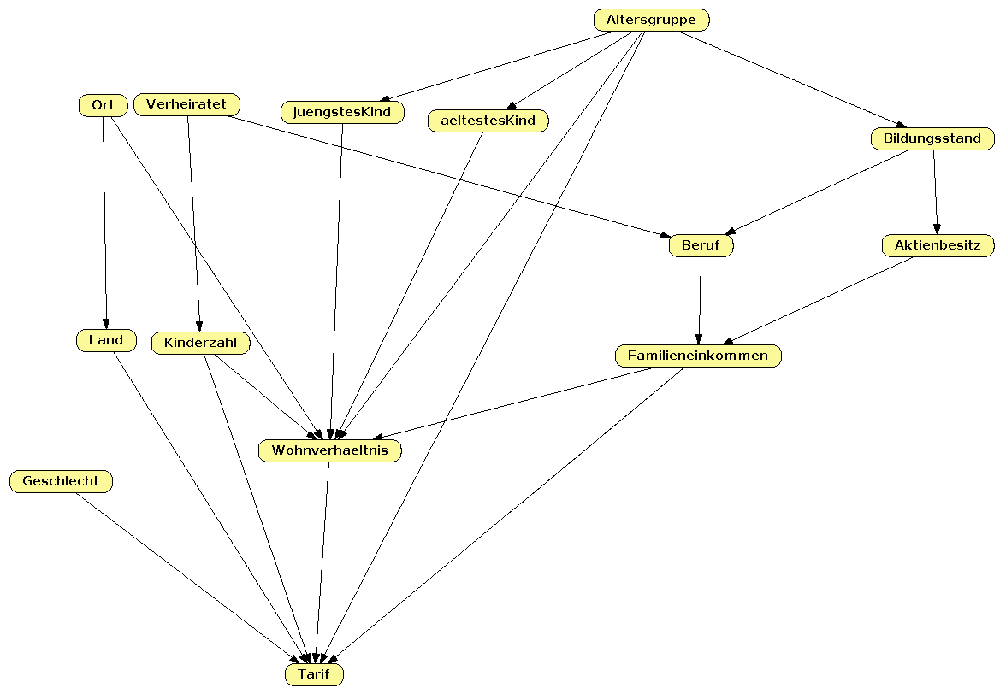
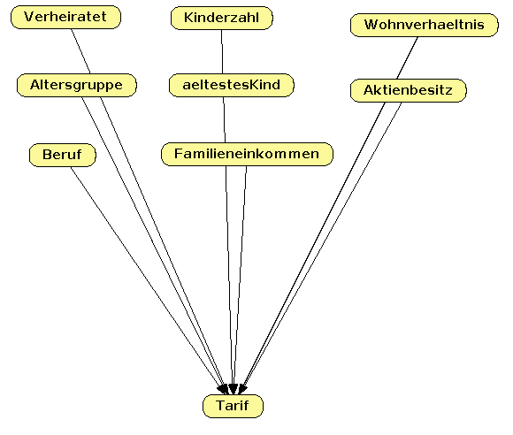
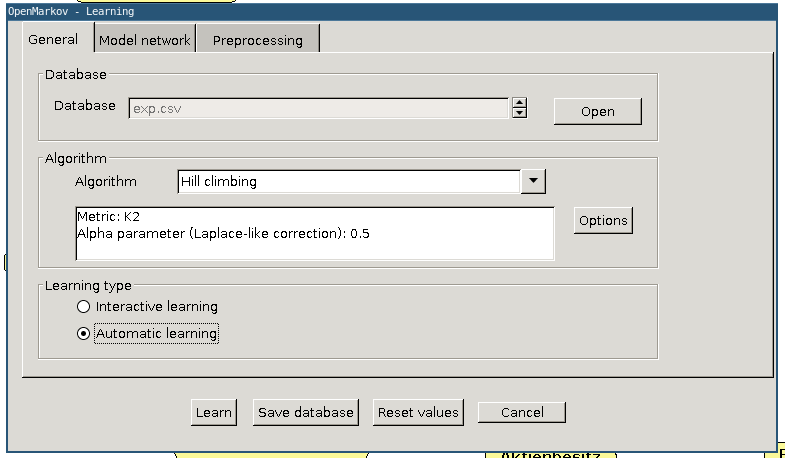
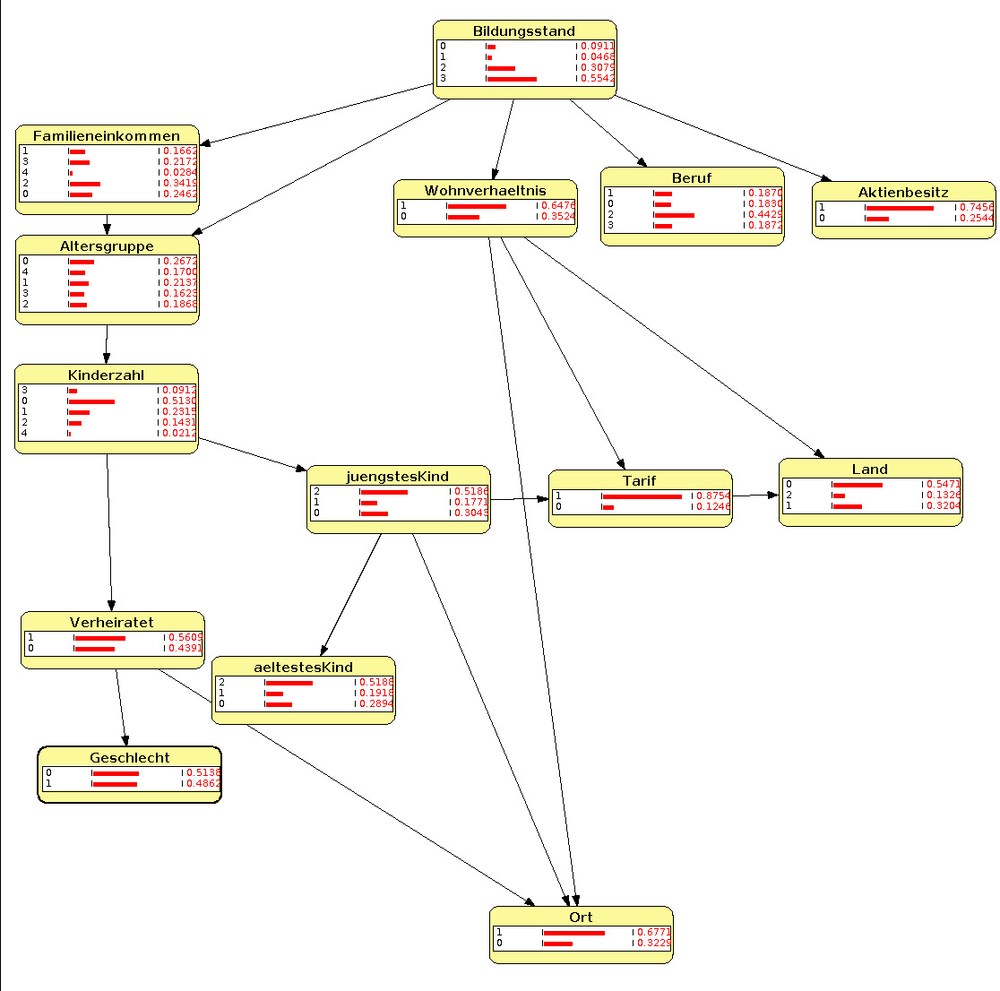
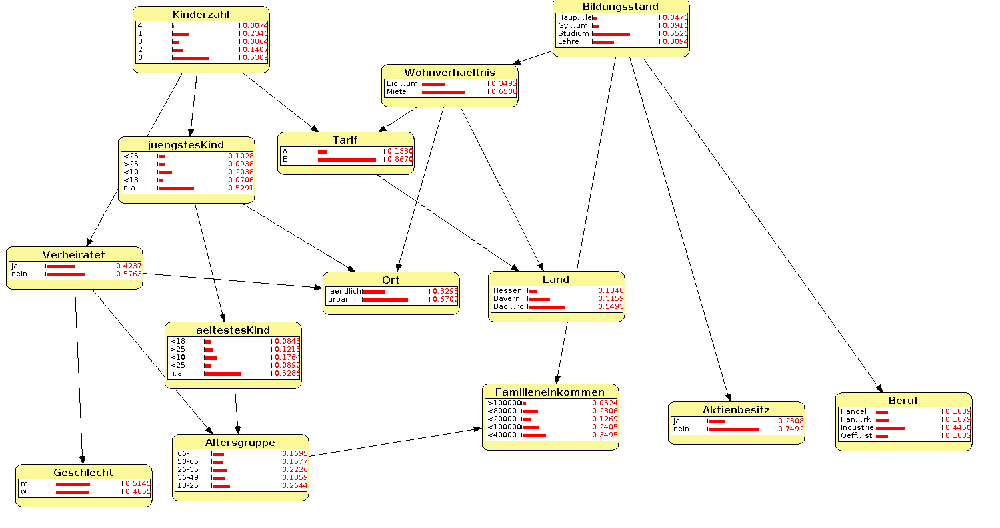

# Forderung
## Fachliche Bearbeitung (25 Punkte)
- Lösungsqualität
- Umfang der Funktionalität
- Konzept
- Korrekte Verwendung von Kernfunktionen
- Anpassung an die Aufgabenstellung
- Nutzung der erworbenen Kenntnisse aus der Vorlesung

## Dokumentation (15 Punkte)
- Begründung von Entwurf und Umsetzung
- Test und Ergebnisbewertung
- Dokumentation des Programms und Codestruktur/Codequalität

---

## Dokumentation
- Netzwerkvisualisierung
  - Eigener Netzwerkentwurf
  - Netzwerkentwurf mit OpenMarkov
- Clustering und Diagramm von continuous data
- Auswahl von Knoten (filtern und vielleicht neue)
- Diagnostische, Kausale, Interkausale, Gemischte Inferenz

## Vorgehensweise

- Analyse
- Netzwerkentwurf
- Training
- Test Modifikationen
- Standalone Programm

## Analyse
Mit Jupyter Notebook kann man interaktiv Python Code ausprobieren und sich auch direkt Graphen anzeigen lassen.
Also haben wir uns zu erst einmal die Daten angesehen.

Interessant ist, dass 87.5% der Beispiele dem Tarif B zugeordnet werden und wir somit nur 25 Beispiele für A haben. Es ist also fraglich, wie gut das Netzwerk dann A vorhersagen kann oder von vorne rein schon darauf ausgelegt ist praktisch alles auf B zu klassifizieren.

Außerdem gibt es bei dem Familieneinkommen eine Lücke zwischen 40k und 60k ohne Beispiele - über diesen Bereich kann man also keine guten Vorhersagen machen.

Was man beim Bayes Netzwerk (zumindest wie wir es gemacht haben) braucht, sind eindeutige Kategorien für die verschiedenen Variablen. Deswegen muss man `aeltestesKind`, `juengstesKind` und `Familieneinkommen` in Buckets einordnen, genau so, wie das bei `Altersgruppe` von vorneherein ist. Dazu haben wir bei dem Alter erstmal `n.a.` durch 0 ersetzt und ein Histogramm erstellt. Man sieht, dass 0 (kein Kind - um ein Histogramm zu erstellen ist 0 sinnvoll, aber das Bayes Netz kennt keine Orderung zwischen den Werten mehr, also schadet es nicht) mit Abstand der häufigste Wert ist. Die restlichen Werte scheinen ein Muster aufzuweisen, was wir uns auch schon ohne Diagramm vorher überlegt hatten: 1-10 (Kind), 11-18 (Jugendlicher), 19-25, >25
Beim Familieneinkommen ergeben 10 Tausender Schritte Sinn - das Diagramm ist auch ungefährt so geclustert. (Nur dass zwischen 40k und 60k nichts ist.

## Netzwerkentwurf

Zuerst haben wir das Netzwerk manuell erstellt. Dabei haben wir uns überlegt, welche Variablen Einfluss auf andere haben könnten. Also beinflusst zum Beispiel ob man verheiratet ist, wie viele Kinder man hat oder ob man einen Beruf ausführt. Am Ende führt alles irgendwie, auch wenn über Umwege auf den Tarif hin.
Das Problem hierbei ist aber, dass wir diese Zusammenhänge nur auf unseren eigenen Erfahrungen und Meinung basieren, ohne dabei auf den konkreten Datensatz zu schauen.

Als Alternative noch ein Netzwerk mit weniger Nodes und Edges um einen Vergleich ziehen zu können:

Um ein Netzwerk basierend auf den Beispieldaten aufzubauen haben wir benutzt:

Was ein Auto-Generiertes Netzwerk ausgibt. (Dabei zu beachten; die Kategorieen wurden in Zahlen umgewandelt, deshalb nur Zahlenwerte zu sehen)

Hier noch ein Durchlauf mit den originalen Kategorienamen und der Kategorisierung auf freie Werte (Familieneikommen etc.). 

## Implementierung
Mit der Python library `pgmpy` ist möglich Bayes Netzwerke nachzubauen.
Zuerst baut man sich das Netzwerk auf. Dazu übergibt man einfach eine Liste mit den gewünschten Kanten. Die Knoten können daraus abgeleitet werden.
Man importiert das CSV in ein `pandas` `DataFrame` und clustert Werte, die es noch nicht sind.
Dann splittet man die Daten in Test und Trainingsdaten auf. Denn wenn man mit denselben Daten teste, mit denen man trainiert ist das Testergebnis deutlich höher. 75% zum trainieren erscheint uns ein guter Wert. So hat man sehr viele Trainingsdaten, aber immer noch 50 Fälle zum Testen.
Sinnvoll ist es noch vorher die Werte zufällig zu sortieren, dass es so nicht zu schlechter Verteilung der Beispiele kommt.
Jetzt ruft man nur noch die `fit` Methode vom Netzwerk auf mit den Trainingsdaten als Parameter und das Training wird durchgeführt.
Durch die verschiedenen Inferenztypen (Diagnostische, Kausale, Interkausale) könnte man die Werte von jeder Variable hervorsagen, deswegen muss man beim testen festlegen, welche Variable man hervorsagen möchte. Das macht man indem man diese Spalte(n) aus den Testdaten löscht und dann an die `predict` Methode vom Netzwerk übergibt.
So bekommt man die hervorgesagten Werte für die Testdatensätze und kann diese mit den richtigen Werten vergleichen.

---

## Test Modifikationen
Die Performance kann beeinflussen, indem man auf verschiende Weisen trainiert.

Man kann
- die verschiedenen Netzwerke trainieren
- das Verhältnis vom Split zwischen Trainingsdaten und Testdaten (0.25, 0.5, 0.75)
- k-fold cross validation (wurde nicht durchgeführt)

|                     | 25% Training | 50% Training | 75% Training |
| ------------------- + ------------ + ------------ + ------------ |
| Eigenes Netzwerk    |    TODO      |  TODO        | TODO         |
| OpenMarkov Netzwerk |    TODO      |  TODO        | TODO         |
| Simples Netzwerk    |    TODO      |  TODO        | TODO         |

## Standalone Programm
- Import Network
- Input CSV -> Output Classification
- Export CPT

Netzwerk wurde mit anderen Notebooks trainiert, die das Netzwerk serialisiert und in die Datei `bayesian_modle.p` geschrieben haben.

Das Programm lädt dieses Netzwerk und liest die Dateien ein. Diese kontinuierlichen Variablen werden dann genauso wie beim Training in Kategorien eingeteilt, falls sie existieren.

Mit diesen Daten wird dann das Netzwerk gefüttert und gibt eine Vorhersage für den wahrscheinlichsten Tarif aus.

Zusätzlich werden die CPTs noch in die Datei `cpd_exp.txt` geschrieben.

## Verbesserungsmöglichkeiten
- Andere Netzwerke
  - Mit weniger nodes
  - Mit mehr Zwischen-nodes (also welche ohne Beispielwerte)
- k-fold cross validation)
